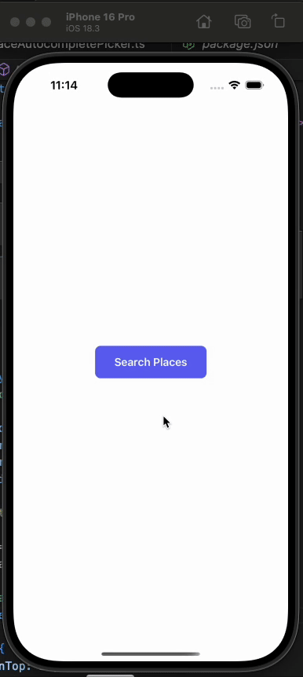
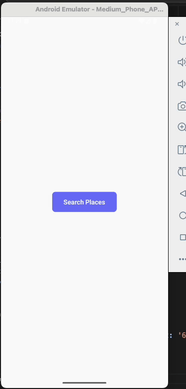

# React Native Place Autocomplete Picker

A fully native, high-performance and easy to use Google Place Autocomplete picker for React Native. Built with the new architecture (Turbo Modules) and the **new Google Places SDK** for maximum performance and a seamless native feel on both iOS and Android.

## Demos

| iOS | Android |
| :---: | :---: |
|  |  |

## ✨ Features

- **🚀 Turbo Module Powered**: Built for the new React Native architecture, ensuring high performance and direct native integration.
- **📍 New Google Places SDK**: Utilizes the latest and most powerful Google Places SDK for accurate and reliable place data.
- **📱 Fully Native UI**: Presents a 100% native autocomplete interface on both iOS and Android for a smooth user experience.
- **🎨 Theme Aware**: Automatically adapts to the device's light and dark modes out of the box.
- **🔧 Customizable**: Control the presentation mode on Android (fullscreen or overlay).
- **📝 Rich Data**: Returns detailed place information, including formatted address, coordinates, and granular `addressComponents` (with long and short names).
- **✅ Simple API**: An easy-to-use API with just two methods: `initialize` and `open`.
- **🤖 Written in Kotlin & Objective-C**: Modern native code for better stability.

## 🔑 Getting Your API Key

This module uses the new Google Places SDK, which requires you to enable the **"Places API (New)"** in your Google Cloud project. You can use an existing API key, but you must ensure this new service is enabled for it.

1. Go to the [Google Cloud Console](https://console.cloud.google.com/).
2. Create a new project or select an existing one.
3. **Enable Billing** for your project.
4. Navigate to **APIs & Services > Library**.
5. Search for **"Places API (New)"** and select it from the results.
    > **Important:** Do not select the legacy "Places API". This module will not work with it.
6. Click the **Enable** button.
7. Go to **APIs & Services > Credentials** to create a new API Key or select an existing one.
8. **Secure your API key!** It is highly recommended to restrict your API key to your specific app identifiers (Bundle ID for iOS, Package Name for Android) and ensure it's authorized to use the "Places API (New)".

## 📦 Installation

Install the package using npm or yarn:

```bash
npm install react-native-place-autocomplete-picker
# --- or ---
yarn add react-native-place-autocomplete-picker
```

## Android Setup

No additional setup is required for Android. The API key is passed programmatically. Just rebuild the project and run.

## Usage

Using the picker is straightforward. First, initialize it with your API key as soon as your app starts, then call the open method to present the UI.

```javascript
import React, { useEffect, useState } from 'react';
import { View, Button, Text, StyleSheet, ScrollView, Platform } from 'react-native';
import * as PlacePicker from 'react-native-place-autocomplete-picker';

// It's recommended to store your API key in a secure way, e.g., environment variables.
const YOUR_API_KEY = "YOUR_GOOGLE_PLACES_API_KEY";

export default function App() {
  const [selectedPlace, setSelectedPlace] = useState(null);

  useEffect(() => {
    // Initialize the module once, e.g., in your root component
    // This connects to the new Places SDK.
    PlacePicker.initialize(YOUR_API_KEY);
  }, []);

  const handleOpenPicker = async (mode) => {
    try {
      const place = await PlacePicker.open(mode);
      console.log(JSON.stringify(place, null, 2));
      setSelectedPlace(place);
    } catch (error) {
      // Handle cancellation or other errors
      console.log(error.message);
    }
  };

  return (
    <ScrollView contentContainerStyle={styles.container}>
      <View style={styles.buttonContainer}>
        <Button title="Open Picker (Fullscreen)" onPress={() => handleOpenPicker('fullscreen')} />
      </View>
      {Platform.OS === 'android' && (
        <View style={styles.buttonContainer}>
          <Button title="Open Picker (Overlay)" onPress={() => handleOpenPicker('overlay')} />
        </View>
      )}

      {selectedPlace && (
        <View style={styles.placeDetails}>
          <Text style={styles.placeName}>{selectedPlace.name}</Text>
          <Text>{selectedPlace.address}</Text>
          <Text>Lat: {selectedPlace.latitude}, Lng: {selectedPlace.longitude}</Text>
          {selectedPlace.postalCode && <Text>Postal Code: {selectedPlace.postalCode}</Text>}
        </View>
      )}
    </ScrollView>
  );
}

const styles = StyleSheet.create({
  container: {
    padding: 20,
  },
  buttonContainer: {
    marginBottom: 10,
  },
  placeDetails: {
    marginTop: 20,
    padding: 15,
    borderWidth: 1,
    borderColor: '#ddd',
    borderRadius: 8,
  },
  placeName: {
    fontWeight: 'bold',
    fontSize: 16,
    marginBottom: 5,
  },
});
```

## API Reference

`initialize(apiKey)`
Initializes the Google Places SDK with your API key. This must be called once before using the open method. Ensure the API key is associated with a project that has the Places API (New) enabled.

`open(mode?)`
Opens the native place picker UI. Returns a promise that resolves with the selected place object or rejects if the user cancels or an error occurs.

Returns: `Promise<Place>`

The promise resolves with a Place object with the following structure:

```typescript
interface Place {
  name: string;
  address: string;
  latitude: number;
  longitude: number;
  postalCode?: string;
  addressComponents?: AddressComponent[];
}

interface AddressComponent {
  longName: string;
  shortName?: string;
  types: string[];
}
```

## 🚧 Future Work

Application Key Restrictions: Currently, the library does not fully support Google Cloud's application key restrictions for both platforms when a single key is used. We plan to add support for platform-specific keys in an upcoming release.

## 🤝 Contributing

Contributions are always welcome! Whether it's bug reports, feature requests, or pull requests, please feel free to contribute.

1. Fork the Project
2. Create your Feature Branch (git checkout -b feature/AmazingFeature)
3. Commit your Changes (git commit -m 'feat: Add some AmazingFeature')
4. Push to the Branch (git push origin feature/AmazingFeature)
5. Open a Pull Request
